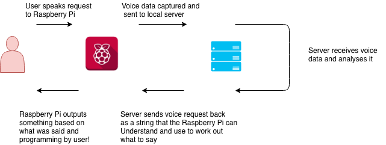

# Building your own AIY assistant

In this workshop you'll be able to begin programming your very own Artificial Intelligence personal assistant in python, controlled by your voice!

### In this worksheet:

- How it works
- Example code
- Challenges to program

### How does it work?
Before you start programming a computer to do certain things depending on what you tell it, we need to get your spoken words into a form the computer can understand.

In a nutshell, we're taking your voice *audio* and turning it into a *string* (otherwise known as text)

When you run your program, the Pi will record your audio and send it to a server the instructor has setup, the server will then listen to your voice, work out what you said and return it as text to your pi.

Once you have your words as text on your Pi, you can tell the computer what to do depending on what you said!

 

### Example Code:
So you don't have to worry about the complicated bit of sending your voice to the server and getting a result, this has already been done for you!

You'll see a method call `Response = AIY_Assistant()` on your program followed by `Print(Response)`, this is where the Pi will prompt you to record your voice and display what you said on the screen.

*Give it a go!, press F5 to run the program, speak to your pi when prompted on screen and see if it displays what you said on screen!*

If it worked... Great! If not... ask a volunteer for help.

At this stage we're ready to start telling the computer to do different things depending on what we say to it, which means we need to tell the computer *only* to do something if *certain words* are heard by it. Below are some examples of basic _conversations_ you can program your AIY assistant to have! You only have to edit code under *Main*, you don't need to touch code anywhere else in the program.

#### Hello World:
`Response = AIY_Assistant()`
`If(Response == "hello"):
  print("Hello world!")`

#### What's your name robot?:
`Response = AIY_Assistant()`
`If("name" in Response):`
` print("My name is Robot!")`
Here we've used the *in* operator, this just checks if the word we're looking for is in the response, e.g. if *name* was in *response*
You can also replace *Robot* with any name you want!

#### What's your name human?:
In this one, The computer asks you your name, you tell the computer what it is and it says it back to you!
`Print("What is your name?")`
`Response = AIY_Assistant()`
`Print("Hello"+Response+"!")`

### Challenges to Program:
In this section are ideas of things you can program your AI assistant to do!
You can decide to follow these or if you have a similar idea you can do that instead!

Don't be afraid to ask a volunteer for help with anything you might get stuck on.

#### What's the weather like?:
In this challenge you can either pre-program a response when the word "weather"
is heard or if you're feeling brave you can get the actual weather from an API challenge

#### Higher or Lower
In this challenge you play the classic game of higher or lower.
If you're unfamiliar with the game it's where the computer chooses a secret number
between 1 and 10, and you have to guess what the number is. If you get it wrong, the
computer tells you if you should guess *higher* or *lower* until you guess the right number.
The less guesses it takes you, the better you do! 
